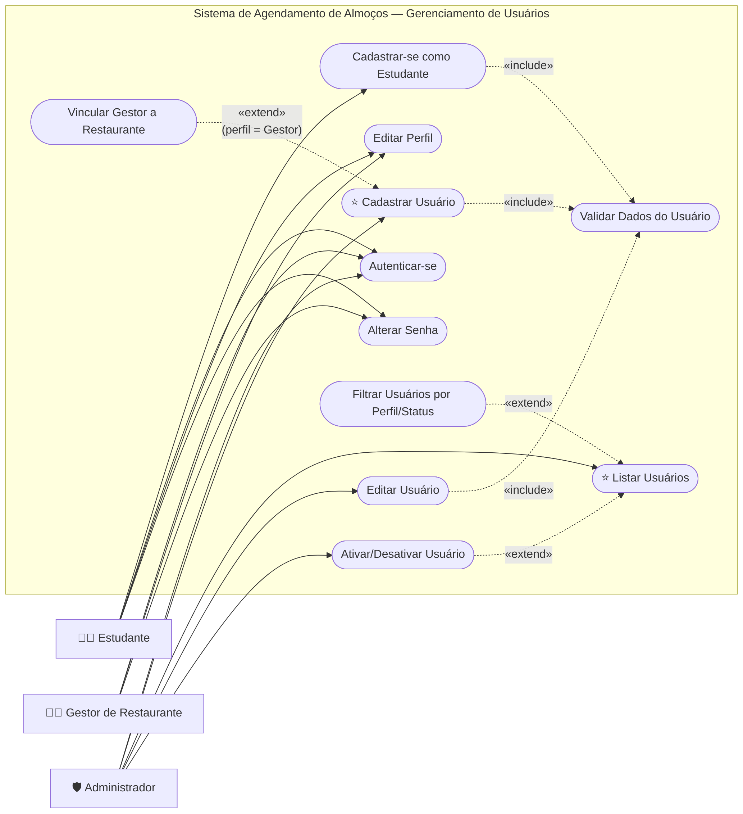
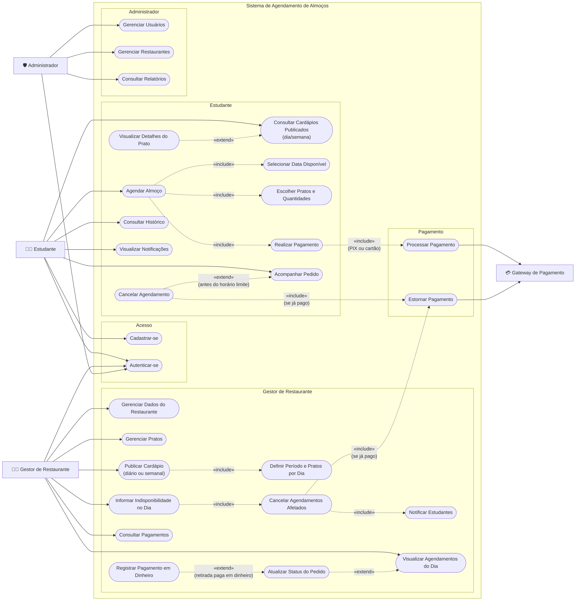

# Diagramas de Casos de Uso

> Convenção de leitura (o Mermaid não tem notação nativa de casos de uso):
> - **Retângulos** são atores; **elipses** (formato arredondado) são casos de uso.
> - Seta contínua (`──►`): associação ator ↔ caso de uso.
> - Seta tracejada com `«include»`: o caso de uso de origem **sempre** executa o de destino.
> - Seta tracejada com `«extend»`: o caso de uso de origem **pode** estender o de destino sob uma condição.

Perfis de usuário do sistema:

| Ator | Descrição |
|------|-----------|
| **Estudante** | Aluno do CI que consulta cardápios e agenda almoços. Faz o próprio cadastro (com matrícula). |
| **Gestor de Restaurante** | Funcionário/responsável de um restaurante parceiro. Publica cardápios e gerencia os pedidos. É cadastrado por um administrador. |
| **Administrador** | Mantém usuários e restaurantes do sistema. |
| **Gateway de Pagamento** | Sistema externo que processa e estorna os pagamentos feitos pelo aplicativo (PIX ou cartão). Não participa do gerenciamento de usuários, por isso só aparece na visão geral. |

---

## 1. Gerenciamento de Usuários (Laboratório 1)

Casos de uso marcados com ⭐ fazem parte da **Sprint 1** (adição e listagem de usuários).

| Caso de uso | Resumo |
|-------------|--------|
| **Cadastrar-se como Estudante** | Estudante informa nome, e-mail, telefone e senha. Conta criada com status `ATIVO`. |
| ⭐ **Cadastrar Usuário** | Administrador cadastra usuário de qualquer perfil (Estudante, Gestor de Restaurante ou Administrador). Se for Gestor, vincula-o a um restaurante. |
| ⭐ **Listar Usuários** | Administrador visualiza todos os usuários cadastrados (nome, e-mail, perfil, status). Pode filtrar e, a partir da lista, ativar/desativar. |
| **Validar Dados do Usuário** | Verifica campos obrigatórios, formato de e-mail, e-mail único e telefone único (Estudante). |

---

## 2. Visão Geral do Sistema

A principal regra de negócio está no fluxo de agendamento: **o estudante só agenda para datas cobertas por um cardápio publicado** (diário ou semanal), e o restaurante pode **informar indisponibilidade no próprio dia**, o que cancela os agendamentos afetados e notifica os estudantes. 

### Descrição dos casos de uso ligados às regras de agendamento

#### Publicar Cardápio (diário ou semanal)
- **Ator:** Gestor de Restaurante
- **Pré-condição:** gestor autenticado; restaurante `ATIVO`; pratos cadastrados.
- **Fluxo principal:**
  1. Gestor escolhe o tipo de cardápio: **diário** (uma data) ou **semanal** (intervalo de datas).
  2. Para cada dia do período, seleciona os pratos oferecidos e, opcionalmente, a quantidade máxima.
  3. Sistema valida que não há outro cardápio publicado sobrepondo as mesmas datas.
  4. Gestor publica. O cardápio passa a `PUBLICADO` e as datas ficam disponíveis para agendamento.
- **Pós-condição:** estudantes conseguem agendar para as datas do período.

#### Agendar Almoço
- **Ator:** Estudante
- **Pré-condição:** estudante autenticado; existe cardápio `PUBLICADO` cobrindo ao menos uma data futura (ou a data de hoje antes do horário limite).
- **Fluxo principal:**
  1. Estudante escolhe o restaurante.
  2. Sistema exibe **somente** as datas cobertas pelo cardápio publicado e ainda dentro da janela de agendamento.
  3. Estudante escolhe a data e os pratos disponíveis naquele dia, com quantidades.
  4. Estudante seleciona a forma de pagamento (PIX, cartão ou dinheiro na retirada) e confirma.
  5. Sistema reserva as quantidades e registra o pedido para aquela data.
  6. Para PIX ou cartão, o pagamento é enviado ao Gateway de Pagamento; quando aprovado, o pedido passa a `AGENDADO`.
- **Fluxos alternativos:**
  - *2a.* Não há cardápio publicado → sistema informa que ainda não há datas disponíveis.
  - *3a.* Prato esgotado/indisponível na data → não pode ser selecionado.
  - *4a.* Estudante escolhe **dinheiro**: o pedido passa direto a `AGENDADO`, sem passar pelo gateway, com pagamento `PENDENTE`. O gestor registra o recebimento no momento da retirada.
  - *6a.* Pagamento recusado → pedido permanece `AGUARDANDO_PAGAMENTO` e as reservas são liberadas após o prazo.

#### Informar Indisponibilidade no Dia
- **Ator:** Gestor de Restaurante
- **Pré-condição:** cardápio `PUBLICADO` cobrindo a data.
- **Fluxo principal:**
  1. Gestor seleciona a data e marca um prato (ou o dia inteiro) como indisponível, informando o motivo.
  2. Sistema identifica os pedidos daquela data que contêm os itens afetados e ainda não foram finalizados.
  3. Sistema cancela esses pedidos com o motivo informado e solicita estorno dos que já foram pagos.
  4. Sistema notifica cada estudante afetado.
- **Pós-condição:** itens ficam `INDISPONIVEL`; novos agendamentos para eles são bloqueados.
