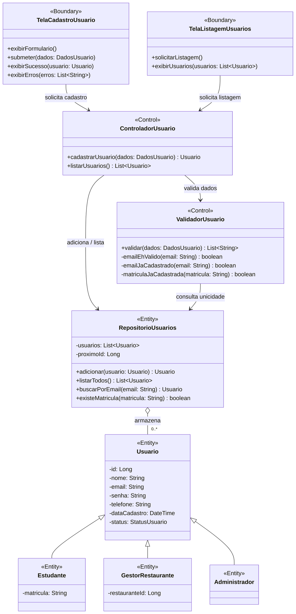
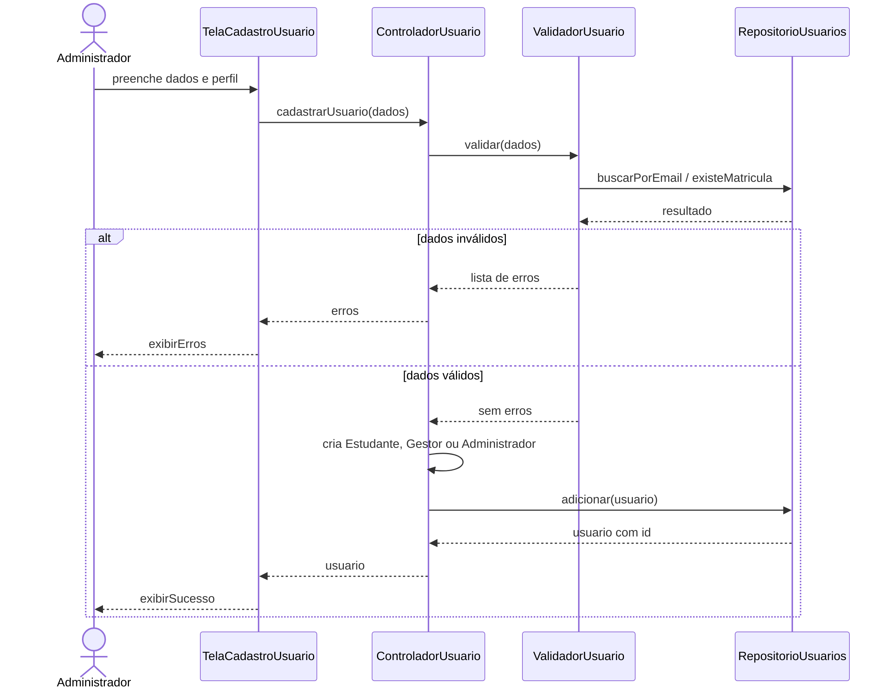
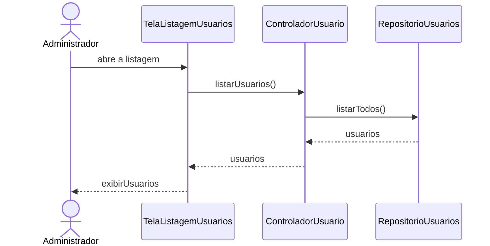
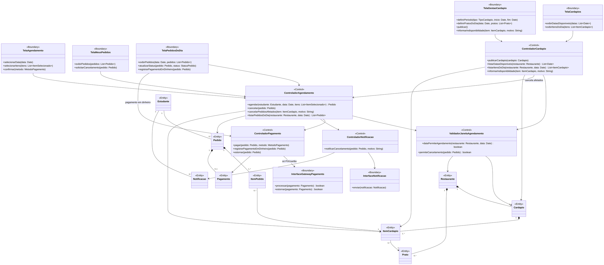
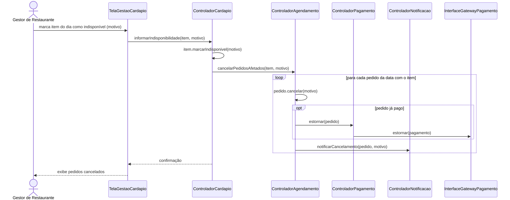

# Diagramas de Classes de Análise (Fronteira, Controle e Entidade)

Estereótipos utilizados:

| Estereótipo | Papel |
|-------------|-------|
| `<<Boundary>>` (Fronteira) | Interface com um ator: telas e integrações com sistemas externos. |
| `<<Control>>` (Controle) | Coordena um caso de uso e aplica as regras de negócio. |
| `<<Entity>>` (Entidade) | Informação persistente do domínio e as coleções que a armazenam. |

Regras de comunicação respeitadas: **Ator ↔ Fronteira ↔ Controle ↔ Entidade**. Fronteiras não acessam entidades diretamente, e entidades não conhecem fronteiras nem controles.

---

## 1. Gerenciamento de Usuários (Sprint 1)

Cobre os casos de uso **Cadastrar Usuário**, **Cadastrar-se como Estudante** e **Listar Usuários**. Na Sprint 1, `RepositorioUsuarios` guarda os usuários numa coleção em **memória RAM**.

### Colaboração: Cadastrar Usuário

### Colaboração: Listar Usuários

---

## 2. Cardápio e Agendamento

Cobre **Publicar Cardápio**, **Agendar Almoço**, **Cancelar Agendamento** e **Informar Indisponibilidade no Dia**, incluindo a regra de que só se agenda dentro do período de um cardápio publicado.

> Os atributos e métodos das entidades estão detalhados em [diagrama-de-classes.md](diagrama-de-classes.md).

### Colaboração: Informar Indisponibilidade no Dia

