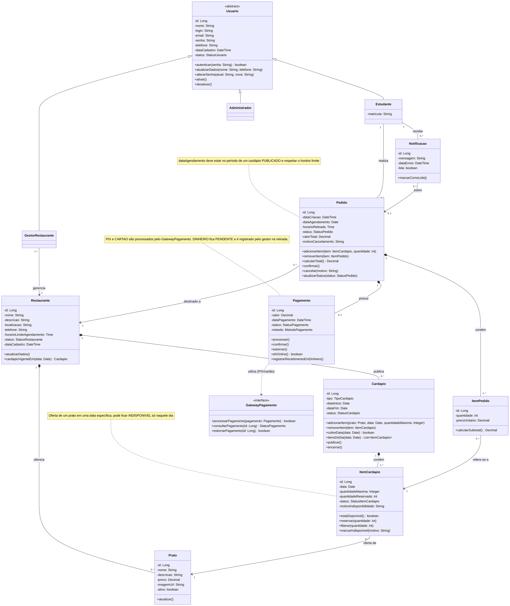
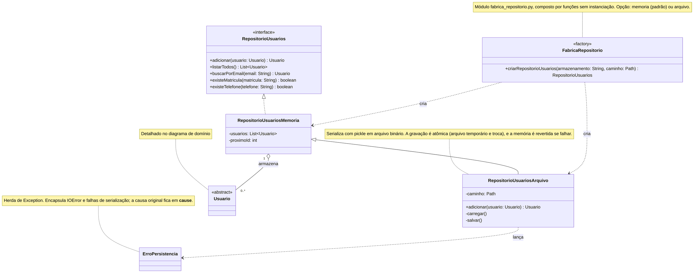
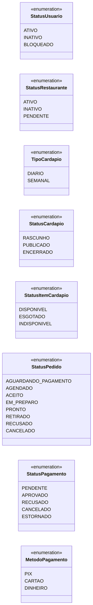

# Diagrama de Classes de Domínio

Este diagrama mostra as entidades do sistema, com seus atributos, operações e relacionamentos. Ele organiza o domínio em quatro partes:

- **Usuários:** `Usuario` é uma classe abstrata, identificada por um `login`, e especializada em `Estudante`, `GestorRestaurante` e `Administrador`. Cada gestor está vinculado ao restaurante que administra.
- **Restaurante e cardápio:** o restaurante mantém seu catálogo de `Prato`s e publica `Cardapio`s **diários** ou **semanais**. Cada `ItemCardapio` representa a oferta de um prato em **uma data específica**, com status próprio. Por isso um prato pode ficar indisponível apenas naquele dia.
- **Pedidos:** o `Pedido` é feito por um estudante para uma data e um restaurante. Seus itens apontam para as ofertas do dia (`ItemCardapio`), e não diretamente para o prato. Isso garante que só se agenda o que foi publicado para aquela data.
- **Pagamento e notificação:** pagamentos via PIX ou cartão passam pelo `GatewayPagamento`, e pagamentos em dinheiro são registrados na retirada. As `Notificacao`s avisam o estudante sobre mudanças no pedido, como o cancelamento por indisponibilidade.

Em seguida, a seção **Cadastro de usuários** detalha as classes de aplicação, domínio e infraestrutura que implementam o cadastro (Laboratório 2): a validação de login e senha por exceções e a persistência dos usuários em memória ou em arquivo binário.

Ao final estão as enumerações, o ciclo de vida do pedido e as formas de pagamento aceitas.

## Cadastro de usuários: validação e persistência

Esta seção mostra as classes que implementam o cadastro de usuários, em dois diagramas. Os nomes seguem o código-fonte, e os membros usam a notação camelCase dos demais diagramas. Entram como **novas no Laboratório 2** o `ValidadorLogin`, o `ValidadorSenha`, o `PoliticaCredenciais`, as exceções (`ErroValidacaoCampo`, `LoginInvalido`, `SenhaInvalida` e `ErroPersistencia`), o `RepositorioUsuariosArquivo` e a `FabricaRepositorio`. As demais classes já existiam e aparecem como contexto.

### Validação do cadastro

O `ControladorUsuario` pede ao `ValidadorUsuario` que valide os `DadosUsuario`. O `ValidadorUsuario` compõe vários validadores independentes (padrão *Composite*) e reúne as mensagens de todos. Se houver erros, o controlador lança `DadosUsuarioInvalidos`.

As regras de login e senha ficam no `PoliticaCredenciais`, que **lança** `LoginInvalido` ou `SenhaInvalida` com todos os motivos encontrados. `ValidadorLogin` e `ValidadorSenha` **capturam** essas exceções e as convertem em mensagens para o `ValidadorUsuario`.

```mermaid
%%{init: {"flowchart": {"useMaxWidth": false}, "class": {"useMaxWidth": false}, "sequence": {"useMaxWidth": false}, "state": {"useMaxWidth": false}}}%%
classDiagram
    direction TB

    class ControladorUsuario {
        -repositorio: RepositorioUsuarios
        -validadorUsuario: ValidadorUsuario
        +cadastrar(dados: DadosUsuario) Usuario
        -criarUsuario(dados: DadosUsuario) Usuario
    }

    class DadosUsuario {
        <<DTO>>
        +perfil: String
        +nome: String
        +login: String
        +email: String
        +senha: String
        +telefone: String
        +matricula: String
        +restauranteId: Long
    }

    class DadosUsuarioInvalidos {
        +erros: List~String~
    }

    class ValidadorUsuario {
        -validadores: List~ValidadorUsuarioBase~
        +validar(dados: DadosUsuario, repositorio: RepositorioUsuarios) List~String~
    }

    class ValidadorUsuarioBase {
        <<abstract>>
        +validar(dados: DadosUsuario, repositorio: RepositorioUsuarios) List~String~
    }

    class ValidadorDadosObrigatorios
    class ValidadorPerfil
    class ValidadorLogin
    class ValidadorEmail
    class ValidadorSenha
    class ValidadorEstudante
    class ValidadorGestorRestaurante

    class PoliticaCredenciais {
        <<utility>>
        +validarLogin(login: String) String
        +validarSenha(senha: String, login: String, email: String)
    }

    class ErroValidacaoCampo {
        +campo: String
        +motivos: List~String~
    }

    class LoginInvalido
    class SenhaInvalida

    class Usuario {
        <<abstract>>
    }

    class RepositorioUsuarios {
        <<interface>>
    }

    ControladorUsuario --> ValidadorUsuario : usa
    ControladorUsuario --> RepositorioUsuarios : usa
    ControladorUsuario ..> DadosUsuario : recebe
    ControladorUsuario ..> Usuario : cria
    ControladorUsuario ..> DadosUsuarioInvalidos : lança

    ValidadorUsuario "1" o-- "0..*" ValidadorUsuarioBase : compõe

    ValidadorUsuarioBase <|-- ValidadorDadosObrigatorios
    ValidadorUsuarioBase <|-- ValidadorPerfil
    ValidadorUsuarioBase <|-- ValidadorLogin
    ValidadorUsuarioBase <|-- ValidadorEmail
    ValidadorUsuarioBase <|-- ValidadorSenha
    ValidadorUsuarioBase <|-- ValidadorEstudante
    ValidadorUsuarioBase <|-- ValidadorGestorRestaurante

    ValidadorEmail ..> RepositorioUsuarios : consulta
    ValidadorEstudante ..> RepositorioUsuarios : consulta

    ValidadorLogin ..> PoliticaCredenciais : usa
    ValidadorSenha ..> PoliticaCredenciais : usa
    ValidadorLogin ..> LoginInvalido : captura
    ValidadorSenha ..> SenhaInvalida : captura

    PoliticaCredenciais ..> LoginInvalido : lança
    PoliticaCredenciais ..> SenhaInvalida : lança

    ErroValidacaoCampo <|-- LoginInvalido
    ErroValidacaoCampo <|-- SenhaInvalida

    note for PoliticaCredenciais "Módulo politica_credenciais.py, composto por funções sem instanciação. Login: não vazio, até 12 caracteres e sem números. Senha (política padrão do AWS IAM): de 8 a 128 caracteres, ao menos 3 dos 4 tipos (maiúsculas, minúsculas, números e especiais) e diferente do login e do e-mail."
    note for ErroValidacaoCampo "Herda de ValueError. Guarda todos os motivos da recusa."
    note for DadosUsuarioInvalidos "Herda de ValueError. Reúne as mensagens de todos os validadores."
    note for ValidadorSenha "Senha vazia já é reportada pelo ValidadorDadosObrigatorios."
    note for Usuario "Detalhado no diagrama de domínio"
```

### Persistência

`RepositorioUsuarios` é a abstração definida no domínio, da qual a aplicação depende. Há duas implementações, escolhidas no início da execução pela `FabricaRepositorio`: em memória (RAM) e em arquivo binário. O `RepositorioUsuariosArquivo` herda do repositório em memória, carrega o arquivo ao iniciar e o regrava a cada inclusão. Falhas de arquivo (`IOError`) e de serialização são encapsuladas em `ErroPersistencia`, de modo que as camadas superiores não dependam de detalhes de infraestrutura.

## Enumerações

### Ciclo de vida do pedido

### Formas de pagamento

| Método | Quando é pago | Passa pelo Gateway? | Status do `Pagamento` ao agendar | Se o pedido for cancelado |
|--------|---------------|---------------------|----------------------------------|---------------------------|
| `PIX` | No aplicativo, ao agendar | Sim | `PENDENTE` → `APROVADO` ou `RECUSADO` | Estorno pelo gateway (`ESTORNADO`) |
| `CARTAO` | No aplicativo, ao agendar | Sim | `PENDENTE` → `APROVADO` ou `RECUSADO` | Estorno pelo gateway (`ESTORNADO`) |
| `DINHEIRO` | No restaurante, na retirada | Não | `PENDENTE` até a retirada, quando vira `APROVADO` | Nada a estornar (`CANCELADO`) |