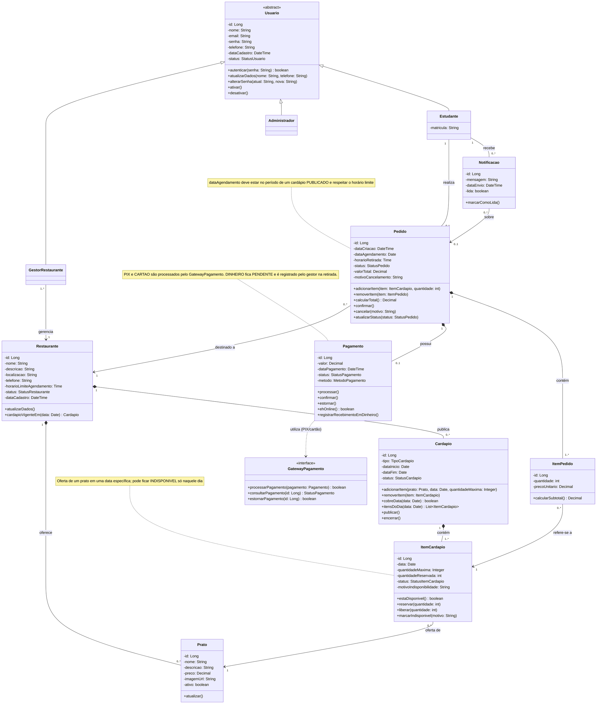
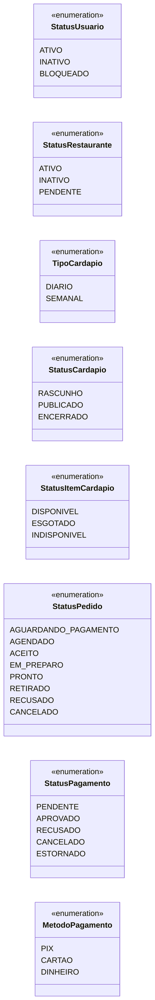
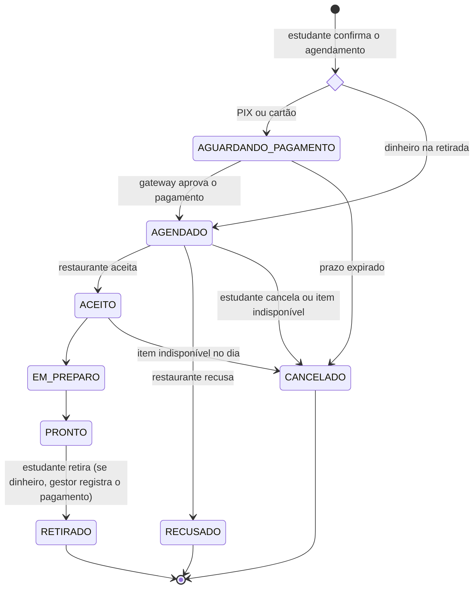

# Diagrama de Classes de Domínio

Este diagrama mostra as entidades do sistema, com seus atributos, operações e relacionamentos. Ele organiza o domínio em quatro partes:

- **Usuários:** `Usuario` é uma classe abstrata especializada em `Estudante`, `GestorRestaurante` e `Administrador`. Cada gestor está vinculado ao restaurante que administra.
- **Restaurante e cardápio:** o restaurante mantém seu catálogo de `Prato`s e publica `Cardapio`s **diários** ou **semanais**. Cada `ItemCardapio` representa a oferta de um prato em **uma data específica**, com status próprio. Por isso um prato pode ficar indisponível apenas naquele dia.
- **Pedidos:** o `Pedido` é feito por um estudante para uma data e um restaurante. Seus itens apontam para as ofertas do dia (`ItemCardapio`), e não diretamente para o prato. Isso garante que só se agenda o que foi publicado para aquela data.
- **Pagamento e notificação:** pagamentos via PIX ou cartão passam pelo `GatewayPagamento`, e pagamentos em dinheiro são registrados na retirada. As `Notificacao`s avisam o estudante sobre mudanças no pedido, como o cancelamento por indisponibilidade.

Ao final estão as enumerações, o ciclo de vida do pedido e as formas de pagamento aceitas.

## Enumerações

### Ciclo de vida do pedido

### Formas de pagamento

| Método | Quando é pago | Passa pelo Gateway? | Status do `Pagamento` ao agendar | Se o pedido for cancelado |
|--------|---------------|---------------------|----------------------------------|---------------------------|
| `PIX` | No aplicativo, ao agendar | Sim | `PENDENTE` → `APROVADO` ou `RECUSADO` | Estorno pelo gateway (`ESTORNADO`) |
| `CARTAO` | No aplicativo, ao agendar | Sim | `PENDENTE` → `APROVADO` ou `RECUSADO` | Estorno pelo gateway (`ESTORNADO`) |
| `DINHEIRO` | No restaurante, na retirada | Não | `PENDENTE` até a retirada, quando vira `APROVADO` | Nada a estornar (`CANCELADO`) |
